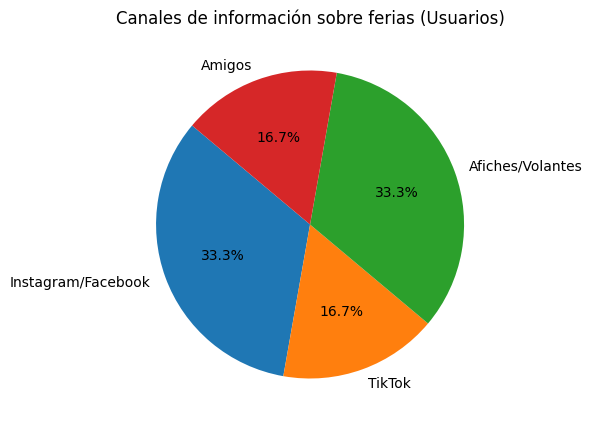
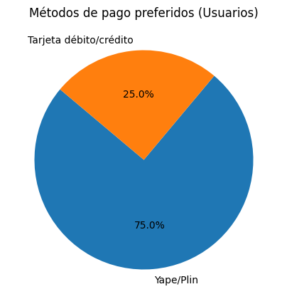
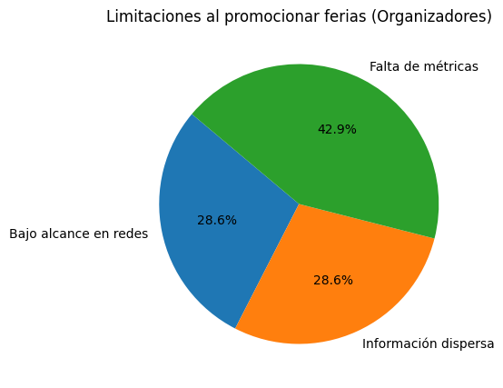
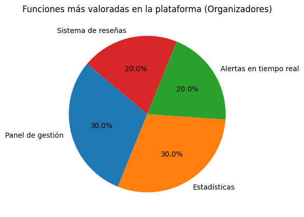

### Capítulo II: Requirements Elicitation & Analysis

---

## 2.1. Competidores 
| **App**        | **Overview**                                                                                                      | **Ventaja Competitiva**                                                                 |
|----------------|------------------------------------------------------------------------------------------------------------------|------------------------------------------------------------------------------------------|
| **Joinnus**    | Plataforma de ticketing que centraliza venta de entradas a conciertos, obras de teatro, festivales y algunos eventos gastronómicos. | Amplia base de usuarios y confianza en el proceso de pago. |
| **Eventbrite** | Plataforma internacional de gestión y promoción de eventos. Los organizadores crean sus propios eventos y venden entradas online. | Herramienta robusta y reconocida globalmente, con soporte multilingüe y métricas avanzadas. |
| **Atrápalo.pe**| Marketplace de experiencias: actividades, restaurantes, viajes y algunos eventos culturales/gastronómicos.        | Ofrece experiencias variadas con descuentos y promociones. |
| **Facebook Events** | Función dentro de Facebook que permite a usuarios y organizadores crear eventos, invitar amigos y dar difusión masiva. | Alcance social enorme y facilidad de compartir eventos en redes. |

---

## 2.1.1. Análisis competitivo

### ¿Por qué tomar en cuenta este análisis?
Este análisis permite identificar las fortalezas y debilidades de los principales actores que hoy concentran el mercado de eventos y ferias en Lima. De esta manera, podemos encontrar espacios de oportunidad para que **NextHappen** se diferencie y se convierta en la plataforma de referencia para ferias gastronómicas.

| **Nombre de los Startups** |                        | **Joinnus** | **Eventbrite** | **Atrápalo.pe** | **Facebook Events** |
|-----------------------------|------------------------|-------------|----------------|-----------------|---------------------|
| **Perfil**                  | Overview               | Plataforma peruana que gestiona entradas a múltiples eventos culturales, deportivos y gastronómicos. | Plataforma global de organización y venta de entradas para eventos de todo tipo. | Marketplace digital con foco en experiencias y ocio, incluyendo algunos eventos culturales. | Red social con función integrada de creación y difusión de eventos abiertos o privados. |
|                             | Ventaja competitiva    | Confiabilidad en pagos y notoriedad en Perú. | Plataforma internacional robusta con muchas integraciones. | Promociones atractivas y diversidad de experiencias. | Difusión masiva gracias a la red social. |
| **Perfil de Marketing**     | Mercado objetivo       | Público joven-adulto que busca eventos culturales o entretenimiento en Lima. | Organizadores profesionales que desean escalar sus eventos. | Usuarios interesados en ocio, viajes y gastronomía. | Usuarios de Facebook de todas las edades que comparten planes sociales. |
|                             | Estrategias de marketing | Campañas en redes sociales, colaboraciones con organizadores y medios. | Estrategia internacional con SEO, SEM y posicionamiento global. | Publicidad online, ofertas y descuentos. | Viralización orgánica, invitaciones directas y segmentación de audiencias. |
| **Perfil del Producto**     | Productos & Servicios  | Venta de entradas, gestión de acceso y marketing digital. | Creación, promoción y venta de entradas. | Venta de experiencias (restaurantes, viajes, eventos). | Difusión de eventos gratuitos o pagos (link externo). |
|                             | Precios & Costos       | Comisión por cada entrada vendida. | Comisión por entradas y planes premium. | Comisión variable sobre reservas y ventas. | Gratuito para publicación, pago en caso de integrar ticketing externo. |
|                             | Canales de distribución | Web y app móvil. | Web y app móvil. | Web y app móvil. | App de Facebook (iOS, Android, Web). |
| **Análisis SWOT**           | Fortalezas             | Marca reconocida, plataforma segura. | Global, completa, con métricas. | Diversidad de experiencias. | Alcance masivo. |
|                             | Debilidades            | Limitado a ticketing, sin personalización ni comunidad foodie. | Poca penetración en Lima y ferias gastronómicas locales. | No especializado en ferias gastronómicas. | Información poco confiable, eventos duplicados o falsos. |
|                             | Oportunidades          | Ampliar al sector gastronómico con experiencias locales. | Expandirse en mercados emergentes. | Asociarse con organizadores gastronómicos. | Integrar más funciones de compra y gestión. |
|                             | Amenazas               | Nuevos players especializados. | Competidores locales más cercanos al mercado. | Baja frecuencia de uso en eventos culturales. | Saturación de la información y baja confiabilidad. |

---

## 2.1.2. Estrategias y tácticas frente a competidores

Nuestra estrategia se basa en la **especialización y confianza**, diferenciándonos de competidores generalistas que no cubren de forma adecuada el ecosistema de ferias gastronómicas en Lima.

🟩 **Especialización en ferias gastronómicas y culturales**: Posicionarnos como la plataforma de referencia, con foco en experiencias auténticas y locales.  

🟩 **Mapa interactivo y alertas en tiempo real**: Funcionalidad inexistente en los competidores.  

🟩 **Sistema de reseñas y comunidad foodie**: Generar confianza a través de recomendaciones verificadas.  

🟩 **Modelo freemium para emprendedores**: Publicación gratuita con opciones de visibilidad premium.  

🟩 **Campañas de marketing local y alianzas**: Trabajo con municipalidades, colectivos gastronómicos y marcas asociadas.  

---

## 2.2. Entrevistas

### 2.2.1. Diseño de entrevistas

#### **Preguntas Generales**
- ¿Cuál es su nombre, edad y distrito de residencia?  
- ¿A qué se dedica actualmente?  

#### **Preguntas para Usuarios (asistentes a ferias)**
- ¿Cómo te enteras de ferias gastronómicas actualmente?  
- ¿Qué dificultades encuentras al buscar información sobre ferias?  
- ¿Qué información consideras indispensable antes de decidir asistir (ubicación, horario, precios, reseñas)?  
- ¿Te interesaría recibir notificaciones en tiempo real sobre ferias cerca de ti?  
- ¿Comprarías entradas de forma digital? ¿Qué método de pago prefieres?  

#### **Preguntas para Emprendedores/Organizadores**
- ¿Cómo promocionas tus ferias actualmente?  
- ¿Qué limitaciones encuentras en redes sociales u otros canales?  
- ¿Qué métricas te gustaría conocer (ventas, asistentes, feedback)?  
- ¿Estarías dispuesto a pagar comisión o suscripción por mayor visibilidad?  
- ¿Qué funcionalidades valoras más en una plataforma digital (alertas, panel de gestión, estadísticas)?  

---

### 2.2.2. Registro de entrevistas

#### Entrevistado N°1 – Usuario

- Nombre: Mariana Rafael  
- Edad: 20  
- Distrito: Lince  
- Duración: 02:24  
- Resumen: Se entera de ferias por Instagram, Facebook y volantes. Considera indispensable un itinerario con puestos, participantes y motivo de la feria. Quiere notificaciones de ferias cercanas y usaría Yape o Plin para pagar.  

---

#### Entrevistado N°2 – Usuario

- Nombre: Milenko Rubén Cayanchi Avila  
- Edad: 19  
- Distrito: Comas  
- Duración: 02:18  
- Resumen: Se informa por Instagram y Facebook. Dificultades con ubicación y horarios. Necesita datos claros y reseñas. Le gustaría recibir notificaciones y pagar con Yape.  

---

#### Entrevistado N°3 – Usuario

- Nombre: Cristhian Talledo  
- Edad: 21  
- Distrito: Jesús María  
- Duración: 02:23  
- Resumen: Se entera por TikTok, Instagram, afiches y amigos. Considera indispensable ubicación en mapa, horarios, precios y reseñas. Quiere notificaciones en tiempo real. Compraría entradas digitales con tarjeta o apps como Yape y Plin.  

---

#### Entrevistado N°4 – Organizador

- Nombre: Carlos Garnique  
- Edad: 25  
- Distrito: Lince  
- Duración: 02:01  
- Resumen: Promociona en redes y WhatsApp, pero con bajo alcance. Necesita métricas claras de ventas y asistencia. Pagará comisión si la plataforma ofrece alcance. Valora panel sencillo, estadísticas, alertas y reseñas.  

---

#### Entrevistado N°5 – Organizador

- Nombre: Renato Gamarra  
- Edad: 28  
- Distrito: Jesús María  
- Duración: 02:52  
- Resumen: Promociona en redes, pero pierde alcance y la información se dispersa. Quiere métricas de entradas, asistentes y feedback. Acepta pagar comisión si aumenta visibilidad. Valora panel simple, estadísticas y notificaciones.  

---

#### Entrevistado N°6 – Organizador

- Nombre: Renato Calvo Yalan  
- Edad: 26  
- Distrito: San Isidro  
- Duración: 01:58  
- Resumen: Promociona en redes, afiches y boca a boca. Limitaciones: bajo alcance y sin métricas en tiempo real. Necesita estadísticas de ventas y asistentes. Pagará por visibilidad. Valora panel centralizado, notificaciones y métricas en vivo.  

---

### 2.2.3. Análisis de entrevistas
Análisis de los datos obtenidos durante las entrevistas:

---

## 2.3. Needfinding

### 2.3.1. User Personas

#### Segmento 1 – Usuario (Mariana Rafael)

---

#### Segmento 2 – Organizador (Carlos Garnique)

---

### 2.3.2. User Task Matrix

> Segmento 1 – Usuario (Mariana Rafael)  

| **Tarea** | **Frecuencia** | **Importancia** |  
|-----------|----------------|-----------------|  
| Buscar información sobre ferias | Often | High |  
| Ubicar ferias en un mapa | Often | High |  
| Comprar entradas online | Occasionally | High |  
| Recibir notificaciones en tiempo real | Often | High |  
| Consultar reseñas de otros asistentes | Occasionally | Medium |  

> Segmento 2 – Organizador (Carlos Garnique)  

| **Tarea** | **Frecuencia** | **Importancia** |  
|-----------|----------------|-----------------|  
| Promocionar ferias en la plataforma | Often | High |  
| Actualizar información en tiempo real | Often | High |  
| Consultar métricas (ventas, asistentes) | Occasionally | High |  
| Gestionar ferias desde un panel centralizado | Occasionally | High |  
| Recibir reseñas y feedback de asistentes | Occasionally | Medium |  

---

### 2.3.3. User Journey Mapping

> Segmento 1 – Mariana Rafael  

---

> Segmento 2 – Carlos Garnique  

---

### 2.3.4. Empathy Mapping

#### Segmento 1 – Mariana Rafael  

---

#### Segmento 2 – Carlos Garnique  

---

### 2.3.5. As-is Scenario Mapping  

> Segmento 1 – Mariana Rafael  

---

> Segmento 2 – Carlos Garnique  

---

## 2.4. Ubiquitous Language
En este proyecto, cuyo objetivo principal es centralizar la información sobre ferias gastronómicas y facilitar la compra de entradas, se define el siguiente lenguaje ubicuo:

| **Término**      | **Definición**                                                                 |
|------------------|---------------------------------------------------------------------------------|
| **Fair (Feria)** | Evento gastronómico, artesanal o cultural con fecha, ubicación y organizador. |
| **Ticket**       | Documento digital que permite el acceso a una feria.                          |
| **Organizer**    | Emprendedor o entidad que crea y gestiona una feria en la plataforma.         |
| **Attendee**     | Usuario que descubre, compra entradas y asiste a una feria.                   |
| **Recommendation** | Evento sugerido al usuario basado en su historial e intereses.              |
| **Alert**        | Notificación en tiempo real sobre nuevas ferias, cambios de horario o promociones. |
| **Map**          | Interfaz visual que muestra las ferias disponibles con filtros de búsqueda.   |
| **Review**       | Calificación o comentario que los asistentes dejan sobre una feria.           |
| **Dashboard**    | Vista exclusiva para organizadores donde administran ferias, ventas y estadísticas. |

### Beneficios esperados del lenguaje ubicuo:
- Claridad en la comunicación entre usuarios, desarrolladores y stakeholders.  
- Consistencia en la documentación y desarrollo del producto.  
- Reducción de errores de interpretación en el equipo de trabajo.  
