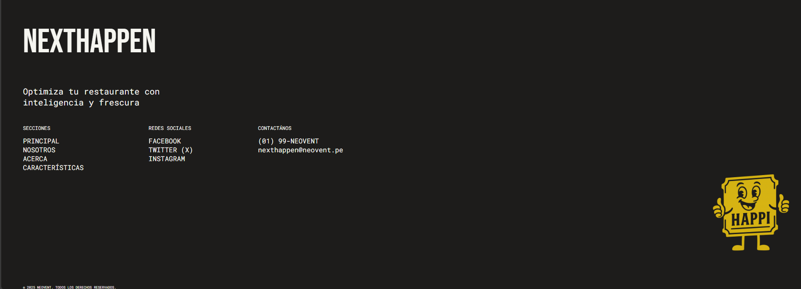

# Capítulo V: Product Implementation, Validation & Deployment

## 5.1. Software Configuration Management  

### 5.1.1. Software Development Environment Configuration  
En seguida, se procederá a describir cada uno de los productos de software que han sido utilizados en el proyecto. Este apartado servirá de suma utilidad para posibilitar que los actuales y futuros desarrolladores puedan contribuir durante el ciclo de vida del proyecto.

## Project Management  

### [Trello](https://trello.com)  
Herramienta utilizada para la gestión de tareas y organización del flujo de trabajo. A través de tableros Kanban, se registraron las actividades planificadas, en proceso y finalizadas, lo que permitió tener una visión clara del avance del equipo en cada etapa del proyecto. Además, se empleó para segmentar el Product Backlog y gestionar los Sprints de manera colaborativa.  

### [Discord](https://discord.com)  
Se utilizó como principal canal de comunicación interna del equipo. Gracias a sus funciones de mensajería, llamadas de voz y videollamadas, fue posible coordinar reuniones periódicas, compartir pantallas para revisiones en conjunto y mantener una comunicación fluida durante todo el desarrollo del proyecto.  

---

## Requirements Management & Product UX/UI Design  

### [Canva](https://www.canva.com/)  
Se empleó para la elaboración de los **User Personas** y **Empathy Maps**, fundamentales para comprender las motivaciones, dolores y expectativas de los segmentos objetivo. Sus plantillas gráficas facilitaron la creación de documentos visuales claros y accesibles para todo el equipo.  

### [Miro](https://miro.com/es/)  
Fue utilizada para la construcción del **User Journey Map**, permitiendo mapear la experiencia de los usuarios a lo largo de su interacción con las ferias gastronómicas. Su dinámica de pizarra colaborativa facilitó el trabajo en tiempo real y la alineación de ideas en equipo.  

### [UXPressia](https://uxpressia.com)  
Se destinó específicamente al desarrollo del **Impact Mapping**, lo cual permitió relacionar los objetivos estratégicos de la plataforma con las necesidades de los usuarios y las funcionalidades propuestas. Esto ayudó a priorizar esfuerzos y mantener la coherencia entre la visión del producto y las soluciones diseñadas.  

### [Figma](https://www.figma.com/)  
Fue la herramienta central en el **Capítulo IV: Product Design**, al utilizarse para la creación de **wireframes** y **mockups** interactivos de la aplicación *NextHappen*. Gracias a su carácter colaborativo y basado en la nube, facilitó la co-creación, la retroalimentación inmediata y la iteración constante del diseño visual.  

---

## Software Development  

### Landing Page (HTML5, CSS3 y JavaScript)  
La página de aterrizaje del proyecto fue desarrollada empleando las tecnologías básicas del desarrollo web: **HTML5** para la estructura, **CSS3** para los estilos y **JavaScript** para la interactividad. Se aplicaron buenas prácticas de nomenclatura (BEM) con el fin de facilitar el mantenimiento y escalabilidad del código. Esta landing sirvió como carta de presentación del producto y espacio inicial de validación con los usuarios.  

### [GitHub](https://github.com)  
Se utilizó como repositorio principal de control de versiones. Permitió al equipo almacenar, organizar y dar seguimiento al código fuente de la landing page y otros entregables. Asimismo, sirvió como medio para la documentación del proyecto mediante el archivo **README.md** y como canal de despliegue gracias a **GitHub Pages**.  

### 5.1.2. Source Code Management  
La gestión de todas las actividades de la startup **Neovent** se lleva a cabo dentro de una organización en **GitHub**, centralizando la documentación y el código fuente del proyecto.  

## Repositorios  

- **Organization:** [Aplicaciones-Web-Grupo-4](https://github.com/Aplicaciones-Web-Grupo-4)  
- **Final Report Repository (Documentación):** [Final Report](https://github.com/Aplicaciones-Web-Grupo-4/Final-Report.git)  
- **Landing Page Repository:** [Landing Page](https://github.com/Aplicaciones-Web-Grupo-4/Landing-Page.git)  

---

### 5.1.3. Source Code Style Guide & Conventions  
En el desarrollo de **NextHappen**, se han adoptado guías de estilo reconocidas que permiten mantener un código legible, consistente y fácil de mantener.  
A continuación, se describen las convenciones aplicadas en este proyecto:

---

## HTML & CSS

Se sigue la **Google HTML/CSS Style Guide**:  
[Guía oficial](https://google.github.io/styleguide/htmlcssguide.html)

**Convenciones aplicadas:**
- Declarar siempre el tipo de documento con `<!DOCTYPE html>`.  
- Usar nombres de elementos en **minúsculas** (`<h1>`, `
`, `<footer>`).  
- Cerrar correctamente los elementos HTML (`<h1></h1>`).  
- Colocar los **atributos entre comillas** (``).  
- Declarar siempre `alt`, `width` y `height` en las imágenes.  
- Mantener un espaciado consistente en el código.  
- Evitar líneas excesivamente largas.  
- Incluir siempre `<title>` dentro de `<head>`.  
- Usar **meta tags** para SEO y responsividad.  
- Organizar las clases de CSS siguiendo la convención **BEM (Block, Element, Modifier)** para mejorar la escalabilidad.  

---

## JavaScript

Se sigue la **Google JavaScript Style Guide**:  
[Guía oficial](https://google.github.io/styleguide/jsguide.html)

**Convenciones aplicadas:**
- Nombrar variables y funciones en **camelCase** (`function openMenu() {}`).  
- Usar **espacios después de comas y dos puntos**.  
- Strings con **comillas simples** (`'texto'`).  
- Siempre finalizar sentencias con `;`.  
- Evitar `var`; usar **`let`** o **`const`**.  
- Mantener funciones cortas y con una única responsabilidad.  
- Comentar solo lo necesario, priorizando código autoexplicativo.

### 5.1.4. Software Deployment Configuration  

  
Para desplegar la Landing Page desde GitHub Pages hay que seguir estos pasos:

  <ol>
    <li>Ubicar el repositorio y dirigirse a <strong>Settings</strong>.</li>
    <li>Seleccionar la sección <strong>Pages</strong>.</li>
    <li>Configurar la rama que será usada para deploy.</li>
  </ol>

## 5.2. Landing Page, Services & Applications Implementation  

### 5.2.1. Sprint 1  

#### 5.2.1.1. Sprint Planning 1  
En esta sección, se presentará el sprint planning 1 donde se describirá de manera detallada cada una de las evidencias planificadas e implementación del *Landing Page*. Asimismo, se evidenciarán los avances del proyecto e *insights* de colaboración en equipo mediante nuestro repositorio de GitHub.

| Sprint # | Sprint 1 |
|----------|-----------|
| **Sprint Planning Background**  |
| **Date** | 2025/09/14 |
| **Time** | 12:56 AM |
| **Location** | Discord |
| **Prepared by** | José Adrian Paredes Dávila |
| **Attendees (to planning meeting)** | Todos los miembros del equipo NeoEvent |
| **Sprint 1 Review Summary** | Dado que es el primer sprint que se está llevando a cabo, no se está considerando los *Review Summary* ya que no hemos recibido ninguno en el sprint anterior. |
| **Sprint 1 Retrospective Summary** | Al ser el primer Sprint, se planea el desarrollo de nuestra landing page mediante el uso de herramientas web nativas como **HTML5, CSS3 y JavaScript**. Adicional a ello, se dialogó con todo el equipo sobre el contenido de los textos que tendrá el landing page, así como el diseño que se ha venido implementando anteriormente en **Figma**. Finalizado el desarrollo, se procederá a desplegar la landing page mediante los servicios de **GitHub Pages** para que cualquier usuario pueda acceder y visualizar la página a través del link generado. |
|**Sprint Goal & User Stories**  
| **Sprint 1 Velocity:**| 18  |
| **Sum of story points:**| 18 | 

#### 5.2.1.2. Aspect Leaders and Collaborators 1  
<table border="1">
  <tr>
    <th>Team Member (Last Name, First Name)</th>
    <th>GitHub Username</th>
    <th>Aspect Name 1 Leader (L) / Collaborator (C)</th>
    <th>Aspect Name 2 Leader (L) / Collaborator (C)</th>
    <th>Aspect Name 3 Leader (L) / Collaborator (C)</th>
  </tr>
  <tr>
    <td>-</td>
    <td></td>
    <td></td>
    <td></td>
    <td></td>
  </tr>
  <tr>
    <td>Ruiz Madrid, Billy Jake</td>
    <td>BJRM03</td>
    <td></td>
    <td></td>
    <td></td>
  </tr>
  <tr>
    <td>Chirito Torres, Jose Raul</td>
    <td>JoseR044</td>
    <td></td>
    <td></td>
    <td></td>
  </tr>
  <tr>
    <td>Martinez Gaona, Pablo Afranio</td>
    <td>Delzekl</td>
    <td></td>
    <td></td>
    <td></td>
  </tr>
  <tr>
    <td>-</td>
    <td></td>
    <td></td>
    <td></td>
    <td></td>
  </tr>
</table>

#### 5.2.1.3. Sprint Backlog 1  
| *User Story* |  |  |  |  |  |  |
|-----------------|-----------------|-----------------|-----------------|-----------------|-----------------|-----------------|
| *ID* | *Title* | *ID* | *Work-item / Task* | *Description* | *Estimation (Hours)* | *Assigned To* | *Status (To-do / In-Process / To-Review / Done)* |
| *US01* | *Acceso a la aplicación* | 01 | Crear botón de acceso | Se diseña e implementa un botón visible que dirija a la aplicación principal. | 1 | Marco | Done |
|  |  | 02 | Ubicar el botón en zona visible | Se asegura que el botón esté en una posición fácil de encontrar en la página principal. | 1 | Marco | Done |
| *US02* | *Cambio de idioma* | 03 | Agregar opción de idioma | Se agregan los botones para cambiar entre español e inglés. | 2 | Marco | Done |
|  |  | 04 | Ajustar textos traducidos | Se verifica que todo el contenido cambie correctamente según el idioma seleccionado. | 2 | Marco | In Process |
| *US03* | *Navegación amigable* | 05 | Adaptar diseño a diferentes pantallas | Se optimiza la visualización de la página en dispositivos móviles, tablets y computadoras. | 2 | Marco | Done |
|  |  | 06 | Revisar usabilidad general | Se prueba que el contenido sea fácil de leer y los elementos estén correctamente alineados. | 1 | Marco | In Process |
| *US04* | *Contenido atractivo* | 07 | Agregar imágenes y carrusel | Se incorporan imágenes y un carrusel interactivo con ferias destacadas. | 2 | Marco | Done |
|  |  | 08 | Ajustar tiempos de transición | Se define la velocidad y fluidez de los carruseles para una mejor experiencia. | 1 | Marco | To Do |
| *US05* | *Conexión con redes sociales* | 09 | Insertar íconos de redes sociales | Se colocan íconos de redes sociales en el pie o menú principal. | 1 | Marco | Done |
|  |  | 10 | Verificar enlaces funcionales | Se revisa que cada ícono redirija correctamente a la red social oficial. | 1 | Marco | To Do |

#### 5.2.1.4. Development Evidence for Sprint Review  
<table>
  <tr>
    <th>Repository</th>
    <th>Branch</th>
    <th>Commit Id</th>
    <th>Commit</th>
    <th>Commit</th>
    <th>Commited</th>
  </tr>
  <tr>
    <td>NeoEvent/Landing-Page</td>
    <td>main</td>
    <td>29d993ea484b9b5e496b438bda6f5e92076161d7</td>
    <td>Initial commit</td>
    <td></td>
    <td>07/09/25</td>
  </tr>
  <tr>
    <td>NeoEvent/Landing-Page</td>
    <td>main</td>
    <td>24e8d878410ecc55498aa5cd358fe0db91b19df4</td>
    <td>Add files via upload</td>
    <td></td>
    <td>07/09/25</td>
  </tr>
  <tr>
    <td>NeoEvent/Landing-Page</td>
    <td>main</td>
    <td>463e00f35d1945dbb6125bb8b0854f447341b140</td>
    <td>update images</td>
    <td></td>
    <td>07/09/25</td>
  </tr>
    <tr>
    <td>NeoEvent/Landing-Page</td>
    <td>main</td>
    <td>c5c13399dd77e057e16e832dbbf291988a0bf4a9</td>
    <td>add functions carousel buttons</td>
    <td></td>
    <td>07/09/25</td>
  </tr>
    <tr>
    <td>NeoEvent/Landing-Page</td>
    <td>main</td>
    <td>1689ad5f8d7bccca0dded24cfdfe22566ecf39e0</td>
    <td>add first version responsive</td>
    <td></td>
    <td>07/09/25</td>
  </tr>
    <tr>
    <td>NeoEvent/Landing-Page</td>
    <td>main</td>
    <td>ff3417cf718c22127186b531c8b9edadfc5d7a97</td>
    <td>add footer</td>
    <td></td>
    <td>08/09/25</td>
  </tr>
    <tr>
    <td>NeoEvent/Landing-Page</td>
    <td>main</td>
    <td>b514ee9e2c83852016457a1d80d414e2cbd23719</td>
    <td>first responsive version</td>
    <td></td>
    <td>08/09/25</td>
  </tr>
    <tr>
    <td>NeoEvent/Landing-Page</td>
    <td>main</td>
    <td>d8479899930908b725d29366419800fe9d328ee3</td>
    <td>version 1.0, with translations and responsive</td>
    <td></td>
    <td>19/09/25</td>
  </tr>
</table>

#### 5.2.1.5. Execution Evidence for Sprint Review  

Para esta entrega NeoEvent implemento el Landing Page, mostrando la información relevante para que los usuarios puedan conocer respecto a nosotros, tales como los integrantes, nuestros valores, funciones, etc. 

  
#### 5.2.1.6. Services Documentation Evidence for Sprint Review  
  
En el primer Sprint el equipo diseñó, programó y puso en funcionamiento la Landing Page para presentar la aplicación web "NEXTHAPPEN".

  <table>
    <thead>
      <tr><th>End Point</th><th>Funciones</th></tr>
    </thead>
    <tbody>
      <tr>
        <td>https://aplicaciones-web-grupo-4.github.io/Landing-Page/</td>
        <td>Mostrar la Landing Page Desplegada</td>
      </tr>
    </tbody>
  </table>

#### 5.2.1.7. Software Deployment Evidence for Sprint Review  

  <a href="https://aplicaciones-web-grupo-4.github.io/Landing-Page/">Landing Page NEXTHAPPEN</a> -
  <a href="https://aplicaciones-web-grupo-4.github.io/Landing-Page/">https://aplicaciones-web-grupo-4.github.io/Landing-Page/</a>

#### 5.2.1.8. Team Collaboration Insights during Sprint  

### 5.2.2. Sprint 2
#### 5.2.2.1. Sprint Planning 2
#### 5.2.2.2. Aspect Leaders and Collaborators

<table border="1">
  <tr>
    <th>Team Member (Last Name, First Name)</th>
    <th>GitHub Username</th>
    <th>Aspect Name 1 Leader (L) / Collaborator (C)</th>
    <th>Aspect Name 2 Leader (L) / Collaborator (C)</th>
    <th>Aspect Name 3 Leader (L) / Collaborator (C)</th>
  </tr>
  <tr>
    <td>-</td>
    <td></td>
    <td></td>
    <td></td>
    <td></td>
  </tr>
  <tr>
    <td>Ruiz Madrid, Billy Jake</td>
    <td>BJRM03</td>
    <td></td>
    <td></td>
    <td></td>
  </tr>
  <tr>
    <td>Chirito Torres, Jose Raul</td>
    <td>JoseR044</td>
    <td></td>
    <td></td>
    <td></td>
  </tr>
  <tr>
    <td>Martinez Gaona, Pablo Afranio</td>
    <td>Delzekl</td>
    <td></td>
    <td></td>
    <td></td>
  </tr>
  <tr>
    <td>-</td>
    <td></td>
    <td></td>
    <td></td>
    <td></td>
  </tr>
</table>

#### 5.2.2.3. Sprint Backlog 2

| *User Story* |  |  |  |  |  |  |
|-----------------|-----------------|-----------------|-----------------|-----------------|-----------------|-----------------|
| *ID* | *Title* | *ID* | *Work-item / Task* | *Description* | *Estimation (Hours)* | *Assigned To* | *Status (To-do / In-Process / To-Review / Done)* |
| *US09* | *Favoritos* | 01 | Agregar botón de “Favoritos” | Implementar un botón visible en cada feria o evento. | 2 | Pablo | Done |
|  |  | 02 | Guardar evento en lista personal | Permitir que el evento marcado se guarde en la lista del usuario. | 2 | Pablo | Done |
| *US14* | *Publicación de feria* | 03 | Crear formulario de registro | Diseñar un formulario con los campos necesarios para registrar la feria. | 3 | Billy | Done |
|  |  | 04 | Guardar y publicar feria | Configurar el guardado y la publicación de la feria en la base de datos. | 2 | Billy | Done |
| *US15* | *Actualización de datos* | 05 | Habilitar edición de horarios y ubicación | Permitir al organizador actualizar la información de su feria. | 3 | Jose Chirito | Done |
|  |  | 06 | Notificar cambios a visitantes | Implementar notificaciones automáticas cuando se actualicen los datos. | 2 | Jose Chirito | Done |
| *US19* | *Panel de información* | 07 | Crear vista de panel administrativo | Diseñar un panel con métricas visuales de los eventos. | 3 | Jose Paredes | Done |
|  |  | 08 | Mostrar estadísticas generales | Configurar la obtención y visualización de estadísticas (asistencias, ventas, etc.). | 2 | Jose Paredes | Done |
| *US21* | *Creación de eventos con detalles completos* | 09 | Añadir campos de imágenes, dirección y fechas | Incorporar estos campos al formulario de creación de eventos. | 3 | Marco | Done |
|  |  | 10 | Mostrar datos completos en la vista de evento | Asegurar que los detalles se visualicen correctamente después de guardar. | 2 | Marco | Done |
| *US22* | *Roles de equipo* | 11 | Crear sección para añadir miembros | Permitir que el organizador agregue integrantes del equipo. | 2 | Jose Chirito | Done |
|  |  | 12 | Asignar roles y accesos limitados | Configurar permisos según el rol asignado (organizador, asistente, apoyo). | 2 | Jose Chirito | Done |

#### 5.2.2.4. Development Evidence for Sprint Review

<table>
  <tr>
    <th>Repository</th>
    <th>Branch</th>
    <th>Commit Id</th>
    <th>Commit</th>
    <th>Commit</th>
    <th>Commited</th>
  </tr>
  <tr>
    <td>NeoEvent/Final-Report</td>
    <td></td>
    <td></td>
    <td></td>
    <td></td>
    <td></td>
  </tr>
  <tr>
    <td>NeoEvent/-</td>
    <td></td>
    <td></td>
    <td></td>
    <td></td>
    <td></td>
  </tr>
  <tr>
    <td>NeoEvent/-</td>
    <td></td>
    <td></td>
    <td></td>
    <td></td>
    <td></td>
  </tr>
  <tr>
    <td>NeoEvent/-</td>
    <td></td>
    <td></td>
    <td></td>
    <td></td>
    <td></td>
  </tr>
  <tr>
    <td>NeoEvent/-</td>
    <td></td>
    <td></td>
    <td></td>
    <td></td>
    <td></td>
  </tr>
</table>

#### 5.2.2.5. Execution Evidence for Sprint Review
#### 5.2.2.6. Services Documentation Evidence for Sprint Review

  
En el segundo Sprint el equipo diseñó, programó y puso en funcionamiento el Front-end para presentar la aplicación web "NEXTHAPPEN".

  <table>
    <thead>
      <tr><th>End Point</th><th>Funciones</th></tr>
    </thead>
    <tbody>
      <tr>
        <td>https://front-end-5r5h.vercel.app/user/home</td>
        <td>Mostrar el Front-end Desplegado</td>
      </tr>
    </tbody>
  </table>
  
#### 5.2.2.7. Software Deployment Evidence for Sprint Review

  <a href="https://front-end-5r5h.vercel.app/user/home">Front-end NEXTHAPPEN</a> -
  <a href="https://front-end-5r5h.vercel.app/user/home">https://front-end-5r5h.vercel.app/user/home</a>

#### 5.2.2.8. Team Collaboration Insights during Sprint

